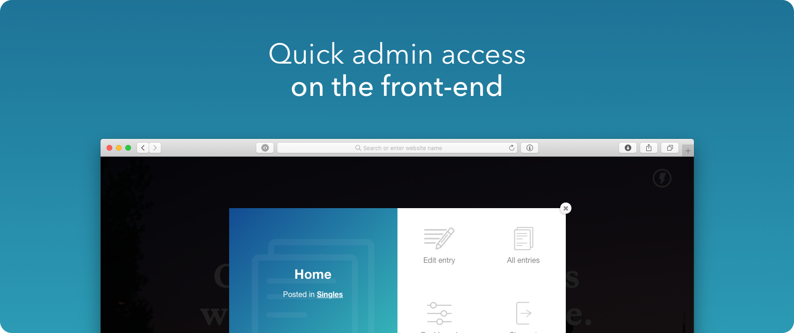
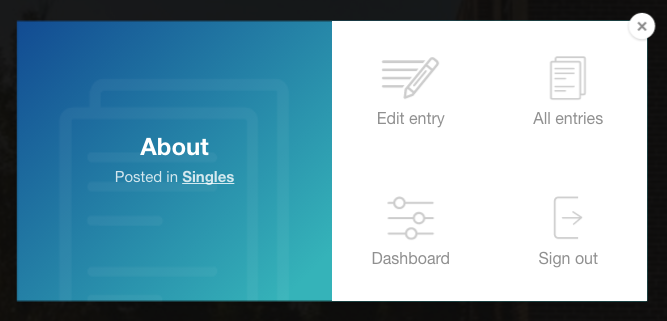

#  Visor

## What is Visor?
Visor is a simple admin overlay to get to the relevant areas of the Craft CMS control panel from the front-end of your site.

## Demo

### Screengrab

## Requirements

This plugin requires Craft CMS 3.0.0-beta.23 or later.

## Installation

To install the plugin, follow these instructions.

1. Open your terminal and go to your Craft project:

        cd /path/to/project

2. Then tell Composer to load the plugin:

        composer require trendyminds/visor

3. In the Control Panel, go to Settings → Plugins and click the “Install” button for Visor.
4. Add `` to your template to add Visor to that page. It's recommended to add this code to your main `_layout.html` file

## Keyboard Shortcuts

You can activate Visor by clicking the gear icon or using the following keyboard shortcuts:

| Key            | Description                 |
|----------------|-----------------------------|
| <code>`</code> | Toggles Visor open or close |
| `ESC`          | Closes Visor (if open)      |

## Customizing Visor

### Overriding styles

Visor has a class of `Visor--override` on the outer `<section>` element. To change any of the default styles, simply start your styles with `.Visor.Visor--override`. This will make your styles more specific without resorting to `!important` madness.

### Overriding icons

Visor also uses inline SVGs for all graphics. This:

- Reduces HTTP requests
- Looks crisp at any pixel density
- Allows you to re-style the icons using `fill` in your CSS

### Overriding background

If you'd prefer to replace purple with a different color you can change this by targeting `.Visor--override .Visor__modal`.

## Browser compatibility
This has been tested on Chrome, Firefox and Safari, but [drop in an Issue](https://github.com/trendyminds/visor/issues/new) if you notice any strangeness.

## Contributing
We welcome anyone and everyone who would like to improve Visor to fork it and send in pull requests. To start developing Visor:

0. Ensure you have Node version 10.x running on your machine
1. Clone the repo to your computer
2. Run `npm i`
3. Run `npm start` to compile the CSS and JS into the main `src/resources/` directory

## Visor Changelog

[View the changelog](https://github.com/trendyminds/visor/blob/master/CHANGELOG.md)
